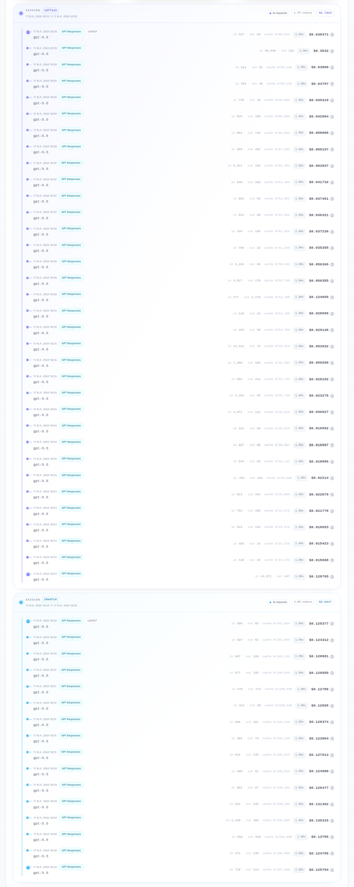

# RelayCode

<p align="center">
  <strong>Single-binary Anthropic-compatible proxy for Claude Code.</strong>
</p>

<p align="center">
  <a href="#why-this-exists">Why this exists</a> ·
  <a href="#quickstart">Quickstart</a> ·
  <a href="#how-it-works">How it works</a> ·
  <a href="#configuration">Configuration</a> ·
  <a href="#providers">Providers</a> ·
  <a href="#development">Development</a>
</p>

---

RelayCode sits between **Claude Code** and model backends. It accepts Anthropic
Messages API requests at `/v1/messages`, routes each request by incoming Claude
model name, then streams Anthropic-shaped SSE back to the client.

Supported upstream protocols:

- OpenAI Chat Completions (`openai_chat`, `POST /v1/chat/completions`)
- OpenAI Responses (`openai_responses`, `POST /v1/responses`)
- Native Anthropic Messages passthrough (`anthropic_messages`, `POST /v1/messages`)

Common use: keep Claude Code UX while routing Opus/Sonnet/Haiku requests to
OpenAI-compatible backends, DeepSeek-style chat endpoints, or Anthropic native
routes.

## Why this exists

Claude Code normally sends conversation history every request. Long agentic
sessions get expensive fast: each tool cycle adds more transcript, and later
requests can replay tens of thousands of input tokens.

RelayCode was built to test a different shape: keep Claude Code as the local
agent UI, but route model calls through a Responses-style backend with upstream
prompt caching. In one end-to-end development run, RelayCode was built from
scratch to working state in about **8 hours**, using about **$150** of model spend
while running Claude Code through RelayCode with a **GPT-5.5** route.

Observed token/cost behavior from that run:

| Scenario | Observed result |
|---|---|
| First request in a session | ~20k-30k input tokens |
| Later cached requests | usually ~1k-2k input tokens |
| Claude Code tool-compatibility test | ~40 requests for about $2-$3 |
| Metrics tracked | request count, cost, input/output tokens, cache read/write |

Real RelayCode log from one session (abbreviated, showing `cache_miss` on the
first turn and `cache_hit` on every turn after — `cached_tokens` grows with the
shared prefix while only the delta is billed as new input):

```text
responses: cache_miss provider=custom_provider_responses model=gpt-5.5 input_tokens=24871 output_tokens=147
responses: cache_hit  provider=custom_provider_responses model=gpt-5.5 cached_tokens=24576 input_tokens=24994 output_tokens=43
responses: cache_hit  provider=custom_provider_responses model=gpt-5.5 cached_tokens=24576 input_tokens=25059 output_tokens=24
responses: cache_hit  provider=custom_provider_responses model=gpt-5.5 cached_tokens=26624 input_tokens=26946 output_tokens=69
responses: cache_hit  provider=custom_provider_responses model=gpt-5.5 cached_tokens=53760 input_tokens=53913 output_tokens=50
responses: cache_hit  provider=custom_provider_responses model=gpt-5.5 cached_tokens=67584 input_tokens=68153 output_tokens=452
responses: cache_hit  provider=custom_provider_responses model=gpt-5.5 cached_tokens=69120 input_tokens=69514 output_tokens=48
```

Those numbers are workload/provider dependent, but the pattern is the point:
once the stable prefix lands in upstream cache, later Claude Code turns stop
paying full-history cost every request.



## Highlights

- **Single Go binary.** No third-party Go dependencies.
- **Model-aware routing.** Case-insensitive substring match on incoming Claude
  model names, plus required `"*"` fallback.
- **Streaming translation.** Emits Anthropic SSE lifecycle with text, thinking,
  tool use, tool input deltas, stop reasons, and token counts where available.
- **Responses cache keying.** `openai_responses` sets `prompt_cache_key` from
  Claude Code `metadata.user_id.session_id` when present.
- **Claude Code fast paths.** Optional local shortcuts for quota probe, command
  prefix detection, title generation, suggestion mode, and filepath extraction.
- **Local web server tools.** Optional local handling for forced Anthropic
  `web_search` / `web_fetch` requests.
- **Debug stats.** `/debug/stats` exposes in-memory session cache counters.

## Quickstart

```bash
go build -o relaycode ./cmd/relaycode
cp relaycode.example.yaml relaycode.yaml
```

Edit `relaycode.yaml`, set provider keys, then run:

```bash
export OPENAI_API_KEY=sk-...
./relaycode -config relaycode.yaml
```

Point Claude Code at RelayCode:

```bash
export ANTHROPIC_BASE_URL=http://127.0.0.1:8080
export ANTHROPIC_AUTH_TOKEN=freecc   # match server.auth_token when configured
claude
```

If `server.auth_token` is empty, RelayCode does not require client auth.

Health check:

```bash
curl http://127.0.0.1:8080/health
```

## How it works

```text
┌──────────────┐   Anthropic        ┌──────────────┐   OpenAI/Anthropic   ┌──────────────┐
│ Claude Code  │ ─── /v1/messages ─▶│  RelayCode   │── chat/responses ───▶│  upstream    │
│   client     │ ◀─── SSE stream ───│              │◀── SSE stream ──────│  provider    │
└──────────────┘                    └──────────────┘                      └──────────────┘
```

Per request, RelayCode:

1. Decodes Anthropic Messages request body.
2. Runs enabled Claude Code fast-path optimizations when request shape matches.
3. Resolves route from `routes[]` using incoming `model`.
4. Handles forced local `web_search` / `web_fetch` when enabled.
5. Builds provider-specific upstream request.
6. Streams upstream SSE back as Anthropic SSE.
7. Updates in-memory Responses session stats when usage data exists.

## Repository layout

```text
cmd/relaycode/                  entrypoint, config flag, signal shutdown
internal/anthropic/             Anthropic request/content types and helpers
internal/config/                stdlib-only YAML subset loader
internal/optim/                 Claude Code fast-path response shortcuts
internal/provider/              adapter interfaces, HTTP/SSE helpers
internal/provider/anthropic/    native Anthropic Messages passthrough adapter
internal/provider/chat/         OpenAI Chat Completions adapter
internal/provider/responses/    OpenAI Responses adapter
internal/router/                model route resolver
internal/server/                HTTP ingress, auth, /health, /debug/stats
internal/session/               in-memory Responses cache/stat store
internal/sse/                   Anthropic SSE writer/builder
internal/streamparse/           thinking/tool-call text parsers
internal/webtools/              local web_search/web_fetch implementation
```

## Configuration

`relaycode.example.yaml`:

```yaml
server:
  host: 127.0.0.1
  port: 8080
  auth_token: ""   # when non-empty, clients must send matching x-api-key / Authorization

  # Local Anthropic web_search/web_fetch handler. Disabled by default because it
  # performs outbound HTTP from the proxy. Runs only when tool_choice forces it.
  enable_web_server_tools: false
  web_fetch_allowed_schemes: http,https
  web_fetch_allow_private_networks: false

  # Claude Code fast-path optimizations. Disable individually for debugging.
  fast_prefix_detection: true
  enable_network_probe_mock: true
  enable_title_generation_skip: true
  enable_suggestion_mode_skip: true
  enable_filepath_extraction_mock: true
  log_request_snapshots: false

routes:
  - match: "opus"
    provider: openai_responses
    model: gpt-5.5
  - match: "sonnet"
    provider: openai_responses
    model: gpt-5.4
  - match: "*"
    provider: deepseek_chat
    model: deepseek-chat

providers:
  openai_responses:
    kind: openai_responses
    base_url: https://api.openai.com/v1
    api_key: "${OPENAI_API_KEY}"
    # http_timeout_seconds: 300
    # http_proxy: "${HTTPS_PROXY}"
    # max_retries: 2
    # max_concurrency: 4
    # codex_auth_path: /home/you/.codex/auth.json
    # experimental_passthrough_server_tools: true

  openai_chat:
    kind: openai_chat
    base_url: https://api.openai.com/v1
    api_key: "${OPENAI_API_KEY}"

  anthropic_native:
    kind: anthropic_messages
    base_url: https://api.anthropic.com/v1
    api_key: "${ANTHROPIC_API_KEY}"

  deepseek_chat:
    kind: openai_chat
    base_url: https://api.deepseek.com/v1
    api_key: "${DEEPSEEK_API_KEY}"
```

Config rules:

- `${VAR}` values expand from process environment at startup.
- YAML parser supports simple nested maps, lists of maps, and scalar values.
  No anchors, flow style, or multiline strings.
- `routes[].match` is case-insensitive substring match against incoming Claude
  model name. First match wins.
- Fallback route with `match: "*"` is required.
- `providers.<name>.kind` must be `openai_chat`, `openai_responses`, or
  `anthropic_messages`.
- Provider adapters are created lazily on first routed request. Missing API key
  only fails when that provider is used.
- `auth_token`, when non-empty, accepts either `x-api-key: <token>`,
  `Authorization: Bearer <token>`, or raw `Authorization: <token>`.

## Providers

### `openai_responses`

Translates Anthropic messages to OpenAI Responses `input[]` items.

Behavior:

- Sends `model`, `input`, `stream: true`, and `instructions` from Anthropic
  system text.
- Maps `max_tokens` to `max_output_tokens`.
- Forwards `temperature`, `top_p`, tools, and function-call outputs.
- Always sends `tool_choice`, `parallel_tool_calls: true`, and `store: false`.
- Sets `prompt_cache_key` from Claude Code session id when available.
- Drops replayed raw Anthropic thinking blocks because Responses API does not
  accept them.
- Rejects user image blocks.

Optional knobs:

- `codex_auth_path`: reads local Codex auth JSON and uses
  `tokens.access_token` as `Authorization: Bearer ...`; also forwards
  `tokens.account_id` as `ChatGPT-Account-ID` when present. Useful when
  targeting OpenAI endpoints that expect Codex-style ChatGPT auth instead of
  normal API key auth.
- `experimental_passthrough_server_tools`: passes Anthropic server tool
  declarations upstream instead of stripping unsupported server-tool entries.
  Keep off unless upstream provider understands those tool shapes.

### `openai_chat`

Translates Anthropic messages to OpenAI Chat Completions `messages[]`.

Behavior:

- Sends system text as `role: system` message.
- Converts regular client tools to OpenAI function tools.
- Streams chat text, reasoning content, and tool-call arguments back to
  Anthropic SSE.
- Sanitizes tool parameter property named `type` to avoid provider schema bugs,
  then restores argument key on streamed tool input.
- Rejects user image blocks.

### `anthropic_messages`

Passes Anthropic request through to upstream `/v1/messages` with model replaced
by routed upstream model.

Behavior:

- Sends `x-api-key` and `anthropic-version: 2023-06-01`.
- Forces `stream: true`.
- Adds `max_tokens: 4096` when missing or zero.
- Pipes upstream Anthropic SSE through with minor policy transforms.

## Tool compatibility

| Claude Code feature | Status | Notes |
|---|---|---|
| Client tools (`Bash`, `Read`, `Write`, `Edit`, etc.) | Works | RelayCode relays function-style tool calls/results. |
| Custom function tools | Works | Converted to provider function tools. |
| Tool argument streaming | Works | Mapped to Anthropic `input_json_delta`. |
| Thinking/reasoning deltas | Works | Chat reasoning and Responses reasoning events map to `thinking_delta`. |
| Local `web_search` / `web_fetch` | Optional | Requires `server.enable_web_server_tools: true` and forced Anthropic server tool choice. |
| Provider-side server tools | Experimental | Use `experimental_passthrough_server_tools` only with compatible upstreams. |
| Images | Native Anthropic only | OpenAI adapters reject user image blocks. Route vision models through `anthropic_messages`. |
| MCP/server-tool replay blocks | Stripped by default | Prevents unsupported opaque blocks from breaking OpenAI-compatible upstreams. |

## Observability

Stats endpoint:

```bash
curl -sS http://127.0.0.1:8080/debug/stats \
  -H "x-api-key: freecc" | jq .
```

Response shape:

```json
{
  "counters": {
    "hits": 0,
    "misses": 0,
    "forced_replays": 0,
    "expired_invalid": 0,
    "input_tokens": 0,
    "output_tokens": 0
  },
  "sessions": [
    {
      "provider": "openai_responses",
      "upstream_model": "gpt-5.5",
      "message_count": 3,
      "response_id": "resp_...",
      "last_used": "2026-05-11T05:32:50Z",
      "input_tokens": 1119,
      "output_tokens": 30
    }
  ]
}
```

Debug logging:

- `RELAYCODE_DEBUG_REQUEST=1`: logs raw incoming `/v1/messages` JSON. Use only
  locally; this can include prompt text.
- `server.log_request_snapshots: true` or `RELAYCODE_LOG_REQUEST_SNAPSHOTS=1`:
  logs scrubbed request shape snapshots without raw prompt text.

## Limitations

- Session store is in memory only. Restart clears stats/cache metadata.
- Responses cache chaining relies on upstream prompt caching via
  `prompt_cache_key`; no WebSocket `previous_response_id` transport.
- OpenAI adapters reject user image blocks.
- Local web tools run only for forced Anthropic web server tool requests.
- Retry only applies to transport errors, HTTP 429, and HTTP 5xx before a stream
  is accepted; mid-stream provider failures are returned as Anthropic SSE errors.

## Development

```bash
go test ./...
go vet ./...
go build -o relaycode ./cmd/relaycode
./relaycode -config relaycode.yaml
```

No external Go dependencies. Tests use standard `go test`.

## License

MIT. See `LICENSE`.
